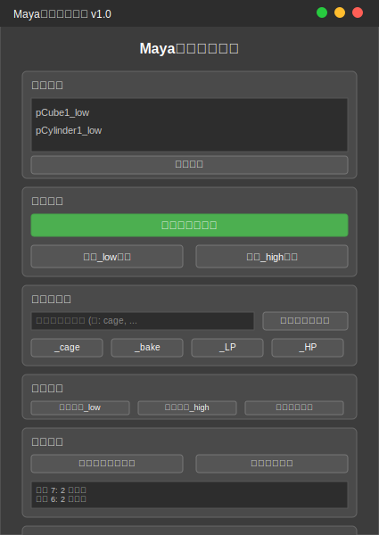

# Maya烘焙命名工具

一个专为Maya到Marmoset Toolbag烘焙工作流设计的快速重命名工具，支持Maya 2023及以前版本。

## 界面预览



*工具的现代化GUI界面，提供直观的操作体验*

## 功能特性

### 🚀 核心功能
- **自动重命名模式**: 第一次选择的物体自动添加`_low`后缀，第二次选择的物体自动添加`_high`后缀
- **快速后缀添加**: 一键为选中物体添加`_low`或`_high`后缀
- **自定义后缀**: 支持添加任意自定义后缀，如`_cage`、`_bake`等
- **预设后缀**: 内置常用后缀按钮（`_cage`、`_bake`、`_LP`、`_HP`）

### 🛠️ 高级功能
- **批量重命名**: 支持对场景中所有物体进行批量重命名
- **撤销/重做**: 完整的操作历史记录和撤销功能
- **命名冲突检测**: 自动检测并处理命名冲突
- **唯一名称生成**: 自动为重复名称添加数字后缀
- **后缀清理**: 一键清理物体名称中的后缀

### 🎨 用户界面
- **现代化GUI**: 基于Qt的直观用户界面
- **实时状态显示**: 显示当前选择和操作状态
- **历史记录查看**: 可视化操作历史
- **设置选项**: 可配置的检查和提示选项

## 安装方法

### 方法一：直接复制到Maya脚本目录

1. 将以下文件复制到Maya脚本目录：
   ```
   maya_baking_renamer.py
   maya_baking_renamer_gui.py
   ```

2. Maya脚本目录位置：
   - **Windows**: `C:\Users\[用户名]\Documents\maya\[版本]\scripts\`
   - **Mac**: `~/Library/Preferences/Autodesk/maya/[版本]/scripts/`
   - **Linux**: `~/maya/[版本]/scripts/`

### 方法二：添加到Python路径

1. 将脚本文件放置在任意目录
2. 在Maya中执行以下代码添加路径：
   ```python
   import sys
   sys.path.append(r"E:\脚本工作区\maya")  # 替换为你的实际路径
   ```

## 使用方法

### 启动工具

在Maya的脚本编辑器中执行以下代码：

```python
# 导入并启动GUI
from maya_baking_renamer_gui import show_maya_baking_renamer_gui
show_maya_baking_renamer_gui()
```

### 基础使用

#### 1. 自动重命名模式（推荐）
1. 点击「自动重命名模式」按钮
2. 选择第一组物体（将自动添加`_low`后缀）
3. 选择第二组物体（将自动添加`_high`后缀）
4. 重复步骤2-3处理更多物体组

#### 2. 手动重命名
1. 选择要重命名的物体
2. 点击对应的后缀按钮：
   - 「添加 _low 后缀」
   - 「添加 _high 后缀」
   - 或使用预设后缀按钮

#### 3. 自定义后缀
1. 在「自定义后缀」输入框中输入后缀名称
2. 点击「应用自定义后缀」或按回车键

### 高级功能

#### 批量操作
- **批量添加 _low**: 为场景中所有transform节点添加`_low`后缀
- **批量添加 _high**: 为场景中所有transform节点添加`_high`后缀
- **清理所有后缀**: 移除选中物体名称中的后缀

#### 历史管理
- **撤销上一次重命名**: 撤销最近的重命名操作
- **清空历史记录**: 清除所有操作历史
- **历史记录查看**: 在界面中查看最近的操作记录

#### 设置选项
- **检查命名冲突**: 启用时会检测重复名称
- **自动生成唯一名称**: 为冲突名称自动添加数字后缀
- **显示操作消息**: 在状态栏显示操作结果

## 命令行使用

如果不需要GUI界面，也可以直接使用核心功能：

```python
from maya_baking_renamer import MayaBakingRenamer

# 创建重命名工具实例
renamer = MayaBakingRenamer()

# 为选中物体添加_low后缀
renamer.rename_to_low()

# 为选中物体添加_high后缀
renamer.rename_to_high()

# 添加自定义后缀
renamer.rename_with_custom_suffix("cage")

# 自动重命名模式
renamer.auto_rename_by_selection_order()

# 撤销上一次操作
renamer.undo_last_rename()
```

## 工作流示例

### Maya到Marmoset烘焙流程

1. **准备模型**：
   - 在Maya中准备好高模和低模
   - 确保模型命名清晰

2. **使用工具重命名**：
   ```
   原始名称: Character_Body, Character_Head
   重命名后: Character_Body_low, Character_Head_low (低模)
            Character_Body_high, Character_Head_high (高模)
   ```

3. **导出到Marmoset**：
   - 导出重命名后的模型
   - 在Marmoset中会自动识别匹配的高低模对

### 批量处理场景

1. **场景准备**：
   - 导入包含多个物体的场景
   - 物体可能有各种命名

2. **批量重命名**：
   - 使用「批量添加 _low」为所有物体添加低模后缀
   - 复制场景，使用「批量添加 _high」创建高模版本

3. **精细调整**：
   - 使用「清理所有后缀」移除不需要的后缀
   - 使用自定义后缀为特殊物体添加标识

## 兼容性

- **Maya版本**: 2018, 2019, 2020, 2022, 2023
- **操作系统**: Windows, macOS, Linux
- **Python版本**: 2.7 (Maya 2018-2022), 3.7+ (Maya 2022+)
- **Qt版本**: 自动检测并使用可用的Qt绑定（PySide2, PySide, PyQt4）

## 故障排除

### 常见问题

**Q: GUI无法启动，提示Qt相关错误**
A: 确保Maya安装了正确的Qt绑定。大多数Maya版本都内置了PySide2。

**Q: 重命名后物体消失**
A: 检查是否有命名冲突。启用「检查命名冲突」选项可以避免此问题。

**Q: 撤销功能不工作**
A: 撤销功能依赖于操作历史，如果清空了历史记录则无法撤销。

**Q: 批量操作影响了不想修改的物体**
A: 批量操作会影响场景中所有transform节点。建议先备份场景或使用选择性重命名。

### 调试模式

如果遇到问题，可以在脚本编辑器中查看详细错误信息：

```python
import maya.cmds as cmds
cmds.scriptEditorInfo(historyFilename="", writeHistory=True)
```

## 更新日志

### v1.0 (2024-01-XX)
- 初始版本发布
- 实现基础重命名功能
- 添加GUI界面
- 支持自动重命名模式
- 实现撤销/重做功能
- 添加批量操作支持
- 实现命名冲突检测

## 许可证

本工具为开源项目，遵循MIT许可证。

## 联系方式

- **作者**: liudan
- **邮箱**: 3236296040@qq.com
- **项目地址**: E:\脚本工作区\maya

## 贡献

欢迎提交问题报告和功能建议！如果你想贡献代码，请：

1. Fork本项目
2. 创建功能分支
3. 提交你的修改
4. 发起Pull Request

---

**享受更高效的Maya烘焙工作流！** 🎯